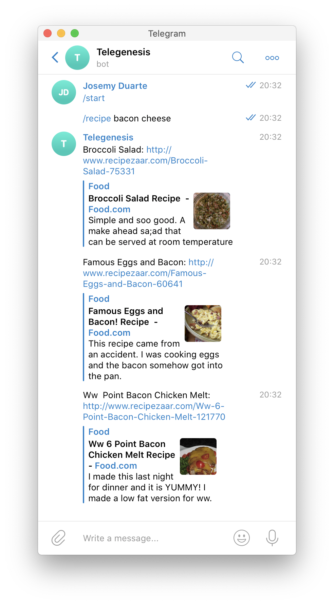

# Recipe Bot

There is a bot for everything, and this is a bot for recipes. It was build making use of [Serverless Framework CLI](https://serverless.com/framework/docs/getting-started/). Why? Just for fun 😉

## How it works?

First, just start a conversation with the bot with a `/start` command/message. After that just send a message like `/recipe [Ingredient1, ingredient2 ...]`. 

## Do you wanna try it?

The main thing you will require is a Telegram Bot Token. Once you have that and with [Docker](https://www.docker.com/) installed, build the image:

`docker build --rm -f "Dockerfile" -t recipebot:latest "."`

And run the Serverless Server 😎:

`docker run -e TELEGRAM_TOKEN=<YOUR_TELEGRAM_TOKEN> -it --rm -p 80:80 recipebot`

Now you only need to use some tunneling tool like [localtunnel](https://github.com/localtunnel/localtunnel) or [ngrok](https://ngrok.com/) and set the url as a webhook to Telegram making a request to this URL:

`https://api.telegram.org/bot<YOUR_TOKEN_BOT>/setWebhook?url=<TUNNELING_URL>/find`